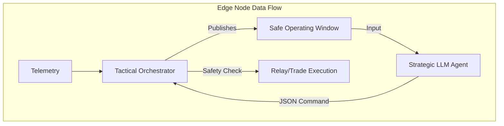

# Tactical Orchestrator: The Safety Governor

The **Tactical Orchestrator** is the deterministic, fast-lane controller for the Intelligent Microgrid. It serves as the safety bridge between the high-level economic decisions of the Strategic LLM Agent and the physical hardware (simulated in this project).

## 1. Overview & Purpose
In a distributed microgrid, household agents (LLMs) negotiate trades based on profit and forecasts. However, LLMs are non-deterministic and can make errors. The Tactical Orchestrator acts as a **Safety Governor** that:
*   **Enforces Hard Constraints**: Blocks any LLM command that would violate battery safety (e.g., discharging below 10% SoC).
*   **Manages Transitions**: Handles complex state changes like disconnecting from the grid (Islanded Mode) during an outage.
*   **Ensures Physical Safety**: Operates in sub-second loops to react to voltage drops or battery emergencies faster than an LLM can reason.

---

## 2. Architecture: The Dual-Layer Brain
The system uses a **Dual-Loop Feedback** architecture:
1.  **Slow Lane (Strategic Layer)**: The LLM analyzes market trends and forecasts.
2.  **Fast Lane (Tactical Layer)**: The Orchestrator monitors physical reality and publishes a "Safe Operating Window."



---

## 3. Core Modules

### 3.1 Finite State Machine (`fsm.py`)
The orchestrator's behavior is driven by a Finite State Machine (FSM) implemented with the `transitions` library. It maintains the system state **in RAM** for zero-latency lookups.

| State | Description |
| :--- | :--- |
| **GRID_CONNECTED** | Default state. Grid is available as a buffer. |
| **P2P_TRADING** | Active energy exchange with a peer node. |
| **ISLANDED** | Grid failure detected; operating solely on PV + Battery. |
| **EMERGENCY** | Critical low battery or fault; internal load-shedding active. |

### 3.2 Safety Buffer (`safety_buffer.py`)
This module enforces the **Privacy-by-Design** and **N-1 Resiliency** goals by protecting the battery.
*   **10% SoC Reserve**: A hard floor. No LLM can request a discharge if the battery is at 10%.
*   **Safety Gate**: The `validate_llm_command` method intercepts JSON commands. If an LLM says `"action": "SELL"` but the battery is low, the orchestrator overrides the command with a REJECT status.

### 3.3 Failover Manager (`failover_manager.py`)
Simulates real-world grid monitoring.
*   **Voltage Thresholds**: Monitors the simulated `voltage_v`. If it drops below 180V, it marks the grid as `FAILED`.
*   **Debounce Mechanism**: To prevent "flapping," it requires 3 consecutive bad readings before triggering the FSM transition to `ISLANDED` mode.

### 3.4 MQTT Handshake (`mqtt_handshake.py`)
Before any P2P energy trade starts, the orchestrators perform a **direct handshake**.
1.  **Request**: Node A sends a `HandshakeRequest` (amount, price) to Node B.
2.  **Check**: Node B's orchestrator checks its own local safety buffer and state.
3.  **Response**: If Node B has surplus and isn't in an emergency, it sends an `ACCEPTED` response.
4.  **Finalization**: The trade is only finalized if the handshake completes within 5 seconds.

### 3.5 Safe Window Publisher (`safe_window.py`)
This is the most critical output for the AI agent. It publishes a JSON object to `microgrid/{node_id}/safe_window` containing:
*   `available_discharge_kwh`: How much energy the LLM is *actually* allowed to sell.
*   `can_trade`: A boolean flag (false during grid outages or emergencies).
*   `constraints`: A list of active limits (e.g., `"DISCHARGE_BLOCKED_LOW_SOC"`).

---

## 4. How the Code Works: The Execution Loop

The `TacticalOrchestrator` class runs a continuous event loop triggered by MQTT messages:

1.  **Receive Telemetry**: When a reading arrives from the `EdgeNode`...
    *   The **Safety Buffer** updates the usable energy capacity.
    *   The **Failover Manager** evaluates grid health.
    *   The **FSM** transitions state if necessary (e.g., Grid Connected -> Islanded).
    *   The **Publisher** sends the new Operating Window to the LLM.

2.  **Receive LLM Command**: When the AI agent sends a decision...
    *   The command is parsed and passed to the **Safety Gate**.
    *   If valid, the **Handshake Protocol** is initiated with the peer node.
    *   Upon successful handshake, the state changes to `P2P_TRADING`.

---

## 5. Running & Testing

### Installation
The orchestrator requires the `transitions` FSM library:
```powershell
pip install transitions
```

### Running a Node Orchestrator
To start the safety governor for a specific home (e.g. `delhi_01`):
```powershell
python -m orchestrator.run_orchestrator --node-id delhi_01
```

### Verification
A suite of 7 unit tests validates the deterministic logic:
```powershell
python -m pytest tests/test_orchestrator.py -v
```
Test categories include:
*   FSM state transition integrity.
*   Grid failure debounce logic.
*   Safety buffer discharge blocking.
*   MQTT handshake packet serialization.

---

## 6. Future Integration (Phase 5)
In the upcoming simulation phases, the orchestrator's `P2P_TRADING` state will trigger physical relay switches via the **Pandapower** electrical simulation, turning the "Safe Operating Window" into actual physical currents.
